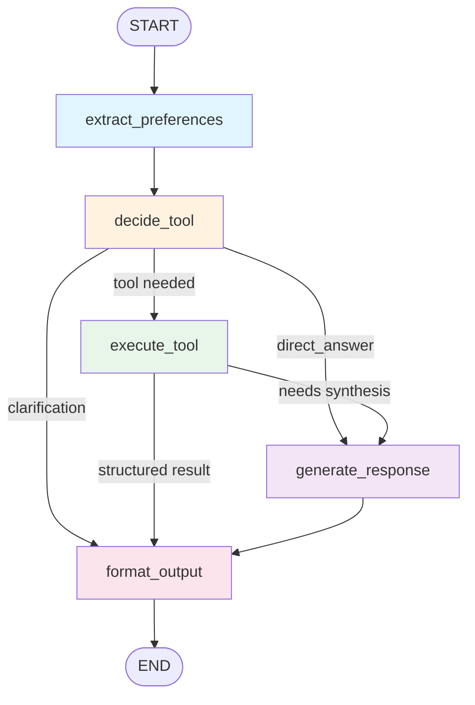

# UK Rent Recommendation System

An AI-powered rental housing recommendation system for international students in the UK. The system combines **RAG (Retrieval-Augmented Generation)**, a **LangGraph StateGraph Agent**, and **interactive map visualization** to help users find suitable accommodation with personalized, data-driven recommendations.

## Table of Contents

- [Features](#features)
- [System Architecture](#system-architecture)
- [LangGraph Agent Architecture](#langgraph-agent-architecture)
- [Project Structure](#project-structure)
- [Tech Stack](#tech-stack)
- [Getting Started](#getting-started)
- [Configuration](#configuration)
- [Usage](#usage)
- [Module Details](#module-details)
  - [RAG System](#rag-system)
  - [LangGraph Agent](#langgraph-agent)
  - [Tool System](#tool-system)
  - [Map Visualization](#map-visualization)
  - [Fine-Tuning](#fine-tuning)

## Features

- **Semantic Property Search** — FAISS-based similarity matching over property descriptions using SentenceTransformer embeddings
- **Three-Source RAG** — Retrieves and ranks results from property embeddings, conversation history, and area knowledge
- **LangGraph StateGraph Agent** — A graph-based agent with conditional routing, majority-voting tool selection, and cross-turn state persistence
- **Interactive Amenity Maps** — Folium/OpenStreetMap-based maps showing nearby amenities (supermarkets, gyms, restaurants, transport) for each property
- **Smart Data Enrichment** — Only fetches safety, amenity, environment, or cost-of-living data when the user's query indicates interest
- **Multi-Source Safety Data** — Crime statistics from police.uk API with exact numbers
- **Commute Cost Calculator** — Travel time and cost estimation via Google Maps or OpenRouteService
- **Web Search Integration** — DuckDuckGo-based search with authoritative source filtering (gov.uk, Rightmove, Zoopla, BBC)
- **Conversation Memory** — ChromaDB-backed persistent chat history for context-aware follow-up responses
- **Budget-Aware Ranking** — Hybrid scoring (semantic similarity, travel time, budget match, soft preferences) with clear budget violation explanations

## System Architecture

```
User Query (Web UI)
      |
      v
+-------------------+
|   Flask Server     |  (app.py)
|   + Unified UI     |
+--------+----------+
         |
         v
+-------------------+
| LangGraph Agent    |  StateGraph with conditional routing
| (langgraph_agent)  |  Majority-voting tool selection
+--------+----------+
         |
    +----+----+
    v         v
+--------+ +--------------+
|  Tool  | | RAG System   |
|Registry| | (3-source)   |
+---+----+ +------+-------+
    |              |
    v              v
+------------------------------+
|  External APIs & Data        |
|  - police.uk (crime)         |
|  - Google Maps / OpenRoute   |
|  - OpenStreetMap (amenities) |
|  - DuckDuckGo (web search)  |
|  - FAISS (embeddings)        |
|  - ChromaDB (memory + area)  |
+------------------------------+
```

## LangGraph Agent Architecture

The agent is built as a **LangGraph StateGraph** with five nodes and two conditional routing edges. This replaces the previous custom ReAct loop with a cleaner, more maintainable graph-based architecture.

### Graph Flow Diagram



### Node Descriptions

| Node | Purpose |
|---|---|
| **extract_preferences** | Parses the user message for hard/soft preferences, excluded areas, required amenities, and lifestyle signals |
| **decide_tool** | Majority voting (5 LLM calls at high temperature) to classify the query into a tool; includes heuristic fallback and tie-breaking |
| **execute_tool** | Dispatches to the ToolRegistry; injects accumulated search criteria for `search_properties`; supports multi-search parallel execution |
| **generate_response** | LLM synthesizes a final answer from tool observations using the Alex persona prompt templates |
| **format_output** | Structures the response for the frontend — sets `response_type`, formats safety/POI/commute data, applies preference filters |

### Routing Logic

```
After decide_tool:
  direct_answer  --> generate_response  (greetings, simple questions)
  clarification  --> format_output      (missing information)
  any tool       --> execute_tool       (needs external data)

After execute_tool:
  structured results (safety/POI/commute/property found) --> format_output
  needs LLM synthesis (web_search, reasoning_property)   --> generate_response
```

### State Schema

```python
class AgentState(TypedDict):
    user_query: str                          # Current user message (with history)
    extracted_context: Dict[str, Any]        # Property context from UI
    user_preferences: Dict[str, List[str]]   # Accumulated preferences
    accumulated_search_criteria: Dict        # Cross-turn search criteria
    tool_decision: Dict[str, Any]            # Selected tool + params
    tool_observation: Optional[str]          # Tool execution result (text)
    tool_raw_data: Optional[Any]             # Tool execution result (structured)
    final_response: str                      # Final response text
    response_type: str                       # answer | question | clarification
    tool_data: Dict[str, Any]                # Structured data for frontend
```

## Project Structure

```
uk_rent_recommendation/
|
+-- local_data_demo/              # Main application
|   +-- app.py                    # Flask server entry point
|   +-- config.py                 # API key configuration
|   +-- unified-ui.html           # Web interface (Alex UI)
|   +-- requirements.txt          # Python dependencies
|   +-- data/
|   |   +-- fake_property_listings.csv   # Sample property data
|   +-- core/                     # Core modules
|   |   +-- langgraph_agent.py    # LangGraph StateGraph agent (main)
|   |   +-- llm_config.py        # Centralized ChatOllama configuration
|   |   +-- langchain_tools.py   # @tool wrappers for LangChain
|   |   +-- react_agent.py       # [DEPRECATED] Legacy ReAct agent
|   |   +-- tool_system.py       # Tool registry & execution framework
|   |   +-- llm_interface.py     # LLM interface (Ollama / Gemini)
|   |   +-- maps_service.py      # Maps, crime data, transport costs
|   |   +-- enrichment_service.py # Conditional data enrichment
|   |   +-- web_search.py        # DuckDuckGo search integration
|   |   +-- data_loader.py       # CSV data loading & parsing
|   |   +-- amenity_map_generator.py  # Interactive map generation
|   |   +-- user_session.py      # Session & favorites management
|   |   +-- tools/                # Tool implementations
|   |       +-- search_properties.py       # Property search
|   |       +-- calculate_commute_cost.py  # Travel cost calculation
|   |       +-- check_safety.py            # Crime statistics lookup
|   |       +-- search_nearby_pois.py      # Nearby amenities search
|   |       +-- get_property_details.py    # Full property information
|   |       +-- web_search.py              # General web search
|   +-- rag/                      # RAG system
|       +-- property_embeddings.py   # FAISS + SentenceTransformer
|       +-- rag_coordinator.py       # Multi-source hybrid ranking
|       +-- conversation_memory.py   # ChromaDB conversation history
|       +-- area_knowledge.py        # London area knowledge base
|
+-- map_visualization/            # Standalone map generator
|   +-- property_amenity_map.py   # Folium map with OSM amenities
|   +-- coordinate_verifier.py    # Geocoding accuracy verification
|   +-- get_google_coordinate.py  # Google Geocoding integration
|
+-- fine_tuning/                  # Model fine-tuning pipeline
|   +-- generate_data.py          # Training data generation
|   +-- train_model.py            # LoRA fine-tuning
|   +-- evaluate_model.py         # Model evaluation
|   +-- production_extractor.py   # Production inference
|   +-- student_model_lora/       # Fine-tuned LoRA adapter weights
|
+-- scrapped_data_demo/           # Legacy demo (web scraping version)
|   +-- app.py
|   +-- ollama_interface.py
|   +-- scrapper/                 # Rightmove & Zoopla scrapers
|
+-- tests/                        # Test files
```

## Tech Stack

| Category | Technologies |
|---|---|
| **Backend** | Flask, Python 3.10+ |
| **Agent Framework** | LangGraph (StateGraph), LangChain, LangChain-Ollama |
| **LLM** | Ollama (local, e.g. Gemma 3 27B), Gemini API (optional) |
| **Vector Database** | ChromaDB (persistent storage) |
| **Embeddings** | SentenceTransformer (`all-MiniLM-L6-v2`) |
| **Similarity Search** | FAISS (`IndexFlatIP` — cosine similarity) |
| **Maps & Geospatial** | Google Maps API, OpenRouteService, Folium, Leaflet, OpenStreetMap |
| **Web Search** | DuckDuckGo (DDGS) |
| **Data Processing** | Pandas, NumPy, Scikit-learn |
| **ML / NLP** | PyTorch, Transformers, Sentence-Transformers |
| **Fine-Tuning** | LoRA (PEFT), Hugging Face Transformers |
| **Frontend** | HTML5, CSS3, JavaScript |

## Getting Started

### Prerequisites

- Python 3.10+
- [Ollama](https://ollama.com/) installed and running (for local LLM inference)
- Git

### Installation

1. **Clone the repository**

   ```bash
   git clone https://github.com/<your-username>/uk_rent_recommendation.git
   cd uk_rent_recommendation
   ```

2. **Install dependencies**

   ```bash
   cd local_data_demo
   pip install -r requirements.txt
   ```

3. **Pull an Ollama model**

   ```bash
   ollama pull gemma3:27b
   ```

4. **Set up environment variables**

   Create a `.env` file in `local_data_demo/`:

   ```env
   GOOGLE_MAPS_API_KEY=your_google_maps_key    # Optional: for accurate travel times
   OPENROUTESERVICE_API_KEY=your_ors_key       # Optional: free alternative for travel times
   GEMINI_API_KEY=your_gemini_key              # Optional: if using Gemini instead of Ollama
   ```

5. **Run the application**

   ```bash
   python app.py
   ```

   Open your browser and navigate to `http://localhost:5001`.

## Configuration

Edit `local_data_demo/config.py` to switch between services:

```python
# Travel time service: 'google' (accurate, paid) or 'openroute' (free, approximate)
USE_TRAVEL_SERVICE = 'google'
```

LLM configuration is centralized in `local_data_demo/core/llm_config.py`:

```python
# Model and endpoint for all LLM calls
MODEL_NAME = "gemma3:27b-cloud"
BASE_URL = "http://localhost:11434"
```

## Usage

1. Open the web interface at `http://localhost:5001`
2. Describe your housing needs in natural language, e.g.:
   - *"I'm looking for a room near UCL under 1500/month with a gym"*
   - *"Find me a safe area near King's Cross with good transport links"*
   - *"What's the commute cost from Vauxhall to UCL?"*
3. The AI agent will autonomously search properties, check safety data, calculate commute times, and present ranked recommendations
4. Follow up with questions — the system remembers your conversation context and accumulated search criteria

## Module Details

### RAG System

The three-source RAG architecture retrieves and ranks information from:

| Source | Storage | Purpose |
|---|---|---|
| **PropertyEmbeddingStore** | FAISS | Semantic similarity search over property descriptions |
| **ConversationMemory** | ChromaDB | Past conversation context for follow-up queries |
| **AreaKnowledgeBase** | ChromaDB | Curated London neighborhood information (safety, vibe, transport) |

**Hybrid Ranking Formula:**

```
score = 0.4 x semantic_similarity
      + 0.3 x travel_time_score
      + 0.2 x budget_match_score
      + 0.1 x soft_preference_match
```

Properties within budget are ranked first; those with soft violations are included with explanations.

### LangGraph Agent

The agent is implemented as a **LangGraph StateGraph** (`core/langgraph_agent.py`) with five nodes:

1. **extract_preferences** — Parses the user message for hard requirements, soft preferences, excluded areas, amenity needs, and lifestyle signals
2. **decide_tool** — Majority voting with 5 LLM calls to classify the query into a tool; includes heuristic fallback and tie-breaking logic
3. **execute_tool** — Dispatches to the ToolRegistry; injects accumulated search criteria for `search_properties`; supports multi-search parallel execution
4. **generate_response** — LLM synthesizes a final answer from tool observations using the Alex persona prompt templates
5. **format_output** — Structures the response for the frontend (safety reports, POI lists, commute costs, property recommendations)

The LLM persona is "Alex" — a friendly rental assistant specialized for international students. Cross-turn state (preferences, accumulated search criteria) is persisted between requests.

**Key design decisions:**
- **Custom StateGraph over prebuilt `create_react_agent`** — The agent has custom nodes (reasoning_property, direct_answer, multi_search) that don't fit standard ReAct
- **Prompt-based majority voting** — 5 LLM calls at `temperature=0.7` vote on tool selection for robustness
- **Accumulated criteria injection** — Follow-up queries inherit budget, destination, and property features from earlier turns

### Tool System

Tools are registered with OpenAI Function Calling format and support:

- Automatic parameter validation (JSON Schema)
- Retry logic with exponential backoff
- Execution time tracking
- Async/sync function support

**Available Tools:**

| Tool | Description |
|---|---|
| `search_properties` | Search rentals on Rightmove, Zoopla, Uhomes |
| `calculate_commute_cost` | Calculate travel time and cost for a route |
| `check_safety` | Look up crime statistics from police.uk |
| `search_nearby_pois` | Find nearby amenities via OpenStreetMap |
| `get_property_details` | Get full details for a specific property |
| `web_search` | General DuckDuckGo search with source verification |
| `get_weather` | Weather information for UK cities |
| `calculate_commute` | Basic commute time calculation |
| `check_transport_cost` | Transport cost estimation |

### Map Visualization

Interactive HTML maps generated with **Folium** and **OpenStreetMap** data:

- Property location marker with popup details
- Color-coded amenity markers (supermarkets, restaurants, gyms, parks, transport stops)
- 1.5 km radius amenity search
- Cuisine-specific restaurant filtering (Chinese, Indian, Italian, etc.)

Generated maps are saved as static HTML files in the `maps/` directory.

### Fine-Tuning

A LoRA fine-tuning pipeline for improving JSON extraction from natural language queries:

- **Data Generation** — Synthetic training data creation
- **Training** — LoRA adapter training on a base LLM
- **Evaluation** — Automated accuracy and format validation
- **Production** — Inference with the fine-tuned adapter for structured output extraction

The fine-tuned model converts free-text user queries into structured search criteria (budget, location, amenities, etc.).

## License

This project is for educational and research purposes.
